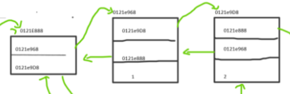
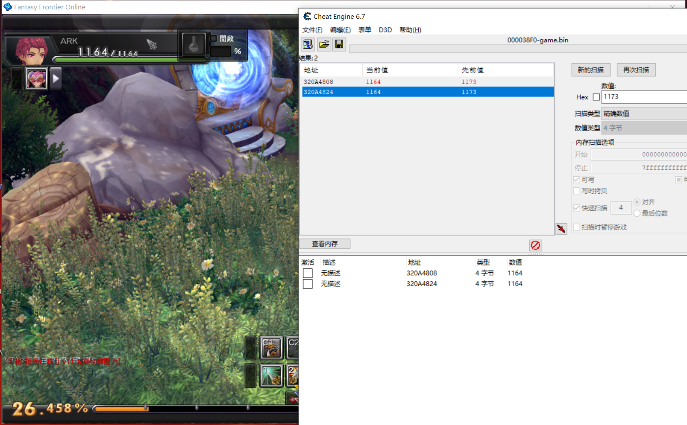
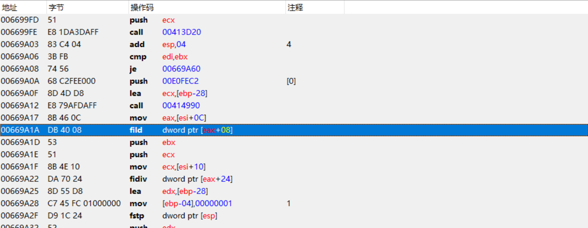
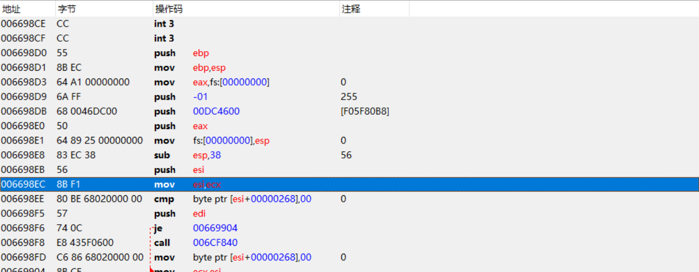
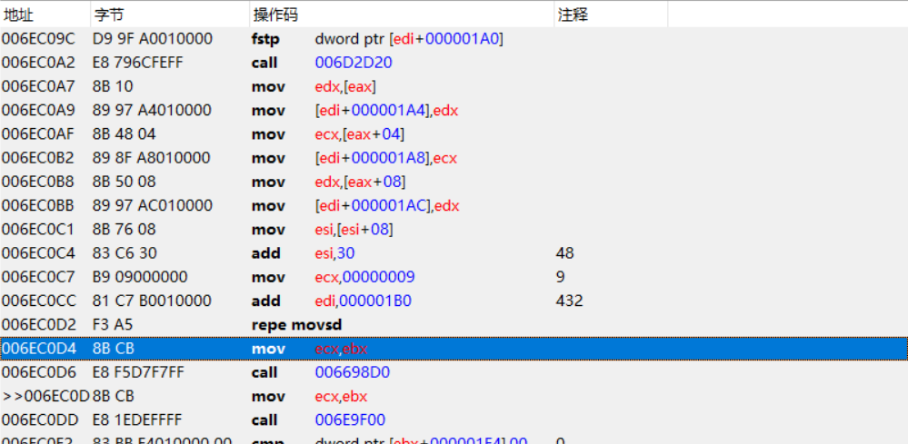
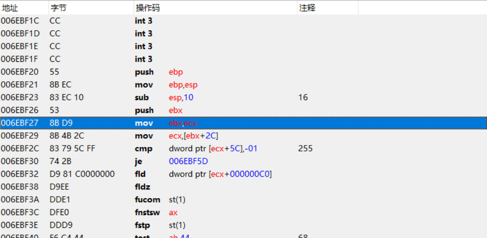
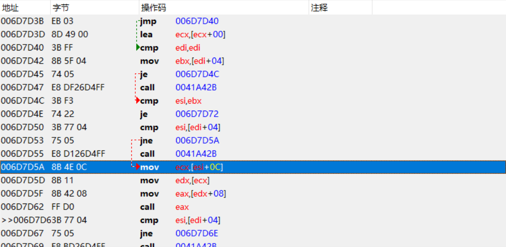
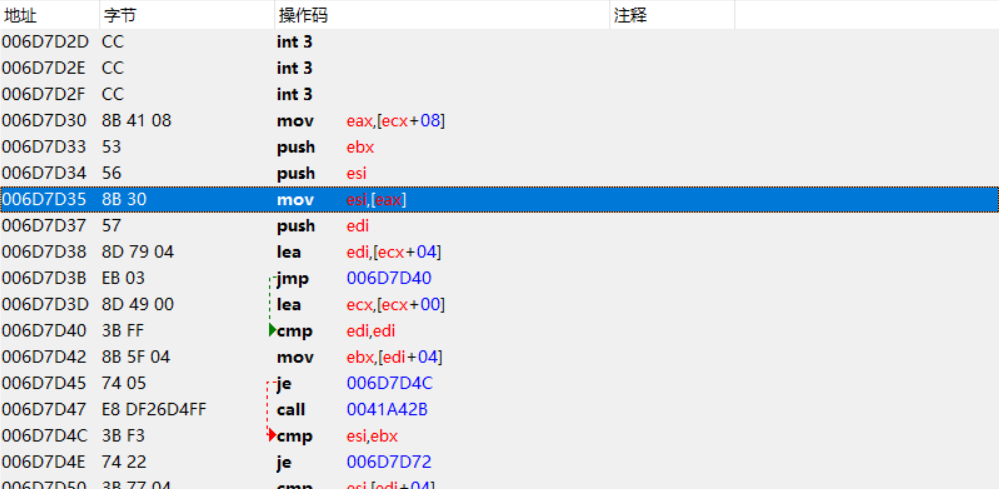
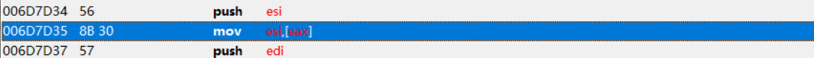

# 数据结构逆向

## C++STL中List模板浅析
游戏中常见的链表一般是通过C++STL中的List模板实现的，通过逆向分析发现List模板下的链表在内存中的存在形式大致如下：


根据此部分具体分析



发现第一个0121E888这个链表头两个指针，一个指向头，一个指向尾，然后剩下的是一个存放数据的循环链表

存放数据的结构体在C++中的实现如下：

```c++
class Node
{
public:
    Node<T> *next;
    Node<T> *last;
    T data;
```

## 游戏中的链表

这一次要找的目标是人物周围的对象链表，包括人物周围的NPC和怪物等等。找这个数据结构的突破口有很多，可以通过人物本身，也可以通过NPC和怪物

这里还是以人物血量为突破口



用CE在血量地址处下访问断点，然后点击人物血量，触发断点



断点断下，[eax+8]是人物的血量，追eax的数据来源，eax来自[esi+0xC]，继续往上追esi

`血量p=[esi+0xC]+8`



esi来自于ecx，返回上层找ecx



ecx又来源于ebx



ebx来源于ecx



ecx=[esi+0xC]

所以原来`[esi+0xC]+0x8`中的esi=ecx=ebx=ecx=[esi+0xC]
此时`血量p=[[[esi+0xC]+0xC]0x8]`
并且在此位置下断点，发现存储血量的地址和esi的值都会不断发生变化。

这个地方的地址一直发生变化说明是已经来到了一个数据结构，如果这个地方单纯的存放的是人物血量的话，就是基址+偏移的方式，不会发生改变

继续往上追esi



esi=[eax]

`血量p=[[[eax]+C]+0xC]+8`

此时本应继续回溯eax，但是在此下断点发现eax这个时候只有两个值在发生变化，而且偏移表达式的地址，不管断下多少次都没有发生改变

从这个地方的变化说明esi的值不来源于eax，也就是说当前的代码不是顺序执行的，有可能是进到了循环里面

那么就有必要分析一下当前的这段代码

分析发现6D7D40是循环的头部，而6D7D70是循环尾部，且在6D7D6E部分将指向esi地址的值重新赋给了esi之后就回到循环头部

esi不来自循环体外的eax，也就说明是来自循环体内的[esi]，esi再往上找还是没有发现来源，说明当前的这一句代码一直在循环取值

如果和数据结构联想到一起的话，很容易联想到上面讲到的链表结构

所以上面这段代码就是通过对Node节点的循环遍历，来找到想要的目标节点，一旦找到就跳出循环体外



esi来源于[eax]，eax就是当前的链表头，这里可以对当前的链表进行取值

```
第一个对象血量:[[[[eax]]+C]+0xC]+8
第二个对象血量:[[[[[eax]]]+C]+0xC]+8
第三个对象血量:[[[[[[eax]]]]+C]+0xC]+8
```

## 总结

对于链表的逆向来说，需要时刻关注追数据过程中每一步的数据结构变化，特别是变化比较明显的那一种。识别链表的标识在于是否有汇编代码在遍历当前的链表不断进行取值，例如：

`mov eax,[eax];`
